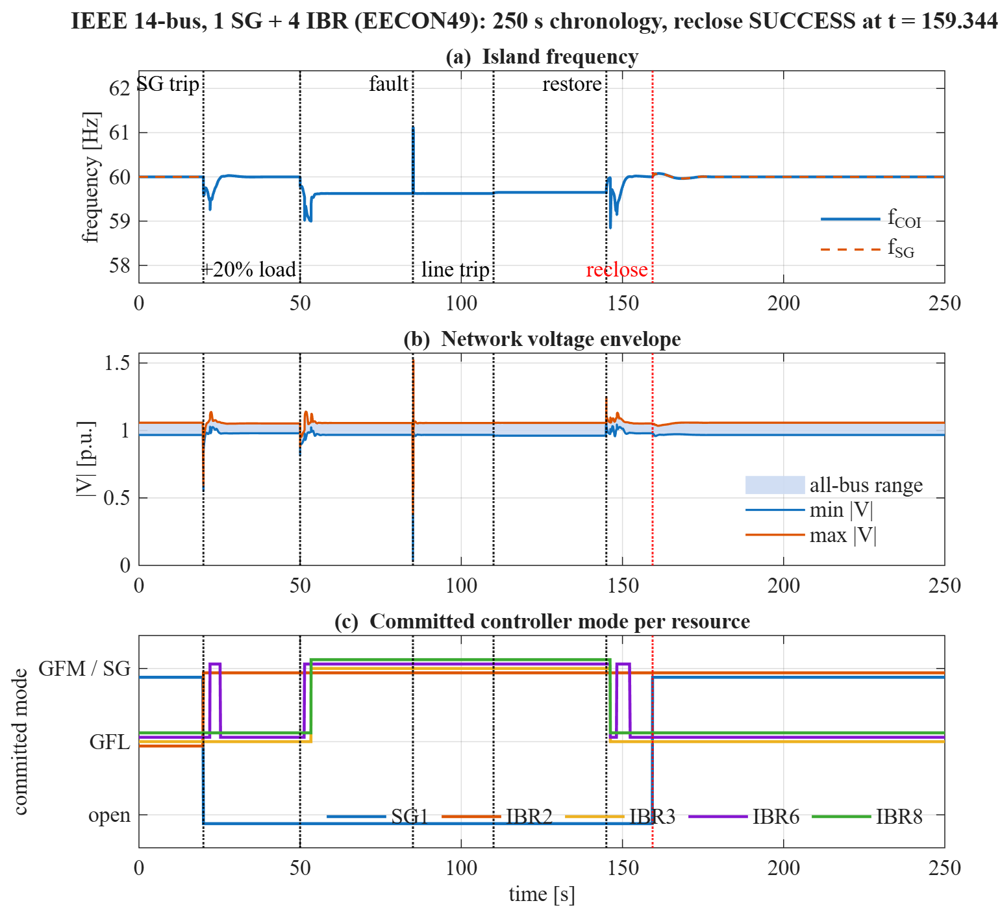
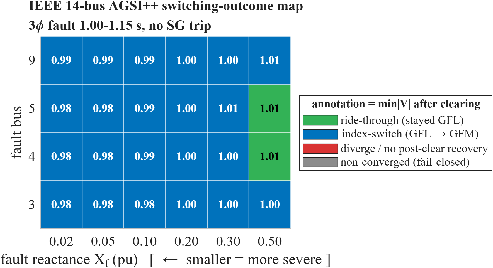

# In-house Power System Analysis Toolkit

**Power flow, small-signal stability, and transient stability for grids with
grid-forming converters — written from the equations up in base MATLAB.**

**Nothing in the production path is borrowed.** Not MATPOWER, not PSAT, not
Simulink, not the Optimization Toolbox. Every production solver in this
repository — the Newton–Raphson power flow, the small-signal state-space
assembly, the coupled differential-algebraic transient kernel, and the converter
models themselves — is project code derived from cited equations. Reference
programs are shipped for cross-checking, but they live in validation scripts,
are unreachable from `pf_init_paths`, and their output can only ever be a
comparison metric — never a production state, parameter, or decision.

---

## The flagship study

A 14-bus network where **four of the five generating units are power
electronics**, supplying the majority of the load. One synchronous machine at
bus 1 (47 % of generation); four dual-mode converters at buses 2, 3, 6 and 8
(53 %), each able to run grid-following (current source, follows the grid) or
grid-forming (voltage source, *is* the grid). Then the synchronous machine is
taken away and the converters have to hold the system up alone — through a load
step, a bolted three-phase fault, a line outage, and finally the machine
resynchronising and closing back in.



| t | event | what the system does |
|---:|---|---|
| 20 s | SG trips | island survives on converters; supervisor promotes units to grid-forming |
| 50 s | all loads +20 % | frequency settles on droop at 59.6 Hz; a second unit is promoted |
| 85 s | 3φ fault at bus 9, cleared in 150 ms | voltage collapses to near zero and the island rides through |
| 110 s | line 6–13 trips | topology change absorbed |
| 145 s | topology restored, reclose requested | synchroniser pulls the machine into phase |
| **159.344 s** | **SG recloses** | **all synchronism gates pass on merit** |
| 250 s | horizon | `f_COI = 60.000000 Hz`, converged, no fallback |

The reclose is not scripted. It happens only when a per-machine synchronism
check passes on **voltage, slip, phase angle and a sustained dwell**
simultaneously, inside a fixed timeout:

```text
dV     0.004743 / 0.05      df  1.59e-05 / 0.001
dtheta 0.9677 deg / 10 deg  limiting_gate = none
```

**Independent check on the answer.** The run is never told where it should end
up, yet at t = 250 s it settles onto the published operating point of the source
case to four significant figures:

| resource | terminal \|S\| | published |
|---|---|---|
| SG1 (bus 1) | 1.3462 pu | 134.62 MVA |
| converter, bus 2 | 0.3631 pu | 36.31 MVA |
| converter, bus 3 | 0.3302 pu | 33.02 MVA |
| converter, bus 6 | 0.5086 pu | 50.86 MVA |
| converter, bus 8 | 0.3064 pu | 30.64 MVA |

Reproduce it:

```matlab
pf_init_paths;
r = run_ieee14_eecon49_chronology('save',true);
generate_readme_chronology_figure('result', ...
    'output/diagnostics/ieee14_eecon49_chronology.mat');
```

---

## What makes this hard, and what the code does about it

Switching a converter between grid-following and grid-forming mid-transient is
not a flag flip. It changes which device owns the network's angle reference,
changes the differential-algebraic structure, and can drop the system outside the
basin of attraction of the configuration you just asked for. Four mechanisms
guard that:

**A precomputed, authenticated configuration table.** Before the run starts,
every candidate set of grid-forming units is solved for its own equilibrium,
linearised with a full-KCL small-signal model, and screened for damping margin at
three finite-difference step sizes — a configuration is admissible only if all
three agree. Short-circuit strength, device current limits, and reference
ownership are separate non-tradeable gates, never traded off against each other
inside one scalar.

**Atomic transactions.** A mode change is applied through device-owned transfer
maps, then accepted only if a full-network Kirchhoff solve converges at the new
operating point. Nothing is published unless it does; a refusal leaves the
previously accepted state untouched, records a named identifier, and arms a
lockout before any retry.

**A forward-simulation certificate.** Before committing a support transition,
the would-be-committed state is integrated forward with the *same* kernel the
run uses, over a horizon derived from the destination's own settling time, and
refused if the island would lose synchronism. The bound is the unstable
equilibrium separation, not the textbook steady-state pull-out angle — converters
with high damping legitimately swing past 90° and recover.

**Least intervention first.** Where a correction is available, the arriving state
is tried *untouched* first and only conditioned if the trial says it will not
survive. Over the 250 s run above, conditioning is applied at exactly one
transaction out of five.

---

## Implemented analyses

| | |
|---|---|
| **Power flow** | in-house Newton–Raphson; bus-type semantics enforced (REF fixes \|V\| and angle, PV fixes P and \|V\|, PQ fixes P and Q); PV→PQ limit switching |
| **Small-signal stability** | full-KCL state-space assembly, network-angle quotient for both machine-online and all-converter cases, participation factors, finite-difference-robust damping margins |
| **Transient stability** | coupled differential-algebraic implicit trapezoidal kernel with domain-preserving Newton globalisation, bounded step subdivision, and an opt-in adaptive stepper that is byte-identical to the fixed path when disabled |
| **Converter models** | grid-following with PLL, grid-forming virtual synchronous machine without PLL, dual-mode devices with bumpless transfer maps, circular current-reference limiting with per-axis anti-windup, DC-source dynamics |
| **Machines** | classical, Padiyar model 1.1 with single-time-constant AVR, six-state EMF model shared by the small-signal and transient paths |
| **Events** | machine trip and reclose with a real synchroniser, load steps, bolted and impedance faults, line outages, topology restoration |

## Validated against the literature

Kundur single-machine-infinite-bus (classical, AVR, PSS, detailed) and the
two-area case; Padiyar two-area four-machine; Saadat worked examples; IEEE 5-,
14-, 30- and 300-bus; the IEEE RTS-24. Reference programs are used for
cross-checking only and are unreachable from the production path and from
`pf_init_paths`.

---

## Quick start

```matlab
run_powerflow        % pick a case, solve with the in-house Newton–Raphson PF
run_sssa             % small-signal analysis on a supported case
run_ts               % transient stability with the four-panel plot
run_ieee14_switch    % the grid-forming/grid-following switching study
```

Non-interactive:

```matlab
pf_init_paths;
r = solve_case('analysis','ts','case','rts24', ...
    'options',struct('plot_results',true,'verbose',true));
```

Padiyar two-area reference study, end to end:

```matlab
pf_init_paths;
pf  = solve_case('analysis','pf',  'case','padiyar_two_area');
ssa = solve_case('analysis','sssa','case','padiyar_two_area');
ts  = solve_case('analysis','ts',  'case','padiyar_two_area', ...
    'options',struct('plot_results',true));
generate_padiyar_two_area_report;
```

That reference deliberately stops at Padiyar model 1.1 with a single-time-constant
AVR — five states per machine. It does not infer sixth-order data or stabiliser
settings that the cited source pages do not publish.

---

## How the numbers are kept honest

This is the part that matters more than any feature list. A stability result is
worthless if you cannot say where every constant came from.

- **Every non-trivial value is classified** before results are produced, as one
  of `SOURCE_DEFINED`, `CASE_DEFINED`, `PROJECT_DERIVED`, `NUMERICAL_METHOD`, or
  `ASSUMED_DIAGNOSTIC`. A diagnostic assumption may never support a readiness
  claim.
- **Nothing is tuned to make a test pass.** Tests are falsification instruments.
  When a test and the code disagree, the governing equation decides which one is
  wrong — and the reason is written down either way.
- **Failures fail closed** with named identifiers instead of falling back
  silently. There is no quiet substitution of a smaller step, a relaxed
  tolerance, or a different model.
- **1655 test functions across 181 files**, plus **45 defect records** under
  `docs/project/defects/`. Each record carries the symptom, a deterministic
  reproduction, the root cause with evidence, and — importantly — the hypotheses
  that measurement *disproved*, so the same dead ends are not re-explored.

A representative parameter study, generated by the same code path:



---

## Repository layout

```
+cases/       case loaders and the canonical case catalog
+pfsolver/    power-flow solvers
+stability/   small-signal and transient kernels, event handling, selectors
+ibr/         converter and dual-mode device models
+smib/        single-machine-infinite-bus studies
scripts/      examples, validation, diagnostics, report generators
tests/        unit and regression tests
docs/         reports (EN/TH), equation-source contracts, defect records
legacy/       archived reference implementations; deliberately off the path
```

`pf_init_paths` adds only `internal/`, `compat/`, `scripts/` and `docs/`. It does
not add `legacy/`.

Reports are built in both English and Thai from the same generated evidence, in
`docs/source/`.

Before changing a solver, a case format, or a numerical contract, read
[AGENTS.md](AGENTS.md) and
[docs/project/AGENT_HANDOFF.md](docs/project/AGENT_HANDOFF.md).

---

## Status

Actively developed research code. The flagship chronology completes and
resynchronises as shown above, with the two behaviours marked opt-in in
`run_ieee14_eecon49_chronology.m` enabled. Small-signal admissibility is a local
equilibrium result and does not by itself certify transient stability;
operational readiness is tracked separately from numerical completion, and the
open items are listed in the handoff rather than hidden.
